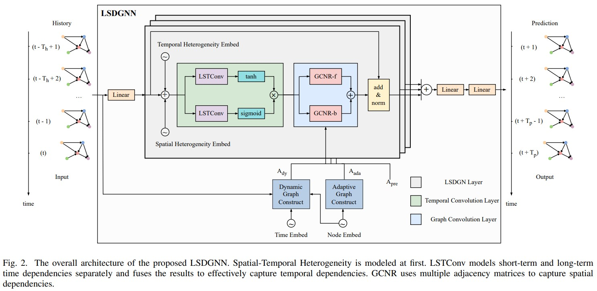

# LSDGNN
Implementation of Long Short Dynamic Graph Neural Network (LSDGNN) in PyTorch

[//]: # ()

## 1 Table of Contents

```text
configs         ->  prepare, train and test configs
datasets        ->  raw data and processed data
models          ->  model implementation
utils           ->  utils
runs            ->  model checkpoint and log
```

## 2. Requirements

```bash
pip install -r requirements.txt
```

## 3. Data Preparation

### 3.1 Download Data

These datasets are packaged in [BaiduYun](https://pan.baidu.com/s/1WWgS-De8_1yihmhX98YAJw?pwd=zlit): `datasets/{METR-LA, PEMS03, PEMS04, PEMS07, PEMS08}`.

### 3.2 Data Preprocess

Run the following command, and generate files `adj_mx.pkl` and `$DATASET_NAME_6_2_2.npz` under path `dataset/$DATASET_NAME`.

$DATASET_NAME is one of {METR-LA, PEMS03, PEMS04, PEMS07, PEMS08}.

```bash
python prepare_data.py --config_filename configs/$DATASET_NAME/prepare.yaml
```

## 4 Train

```bash
python train.py --config_filename configs/$DATASET_NAME/train.yaml
```

## 5 Test

Modify `model_state_pth` and `has_saved_state`

```bash
python run_demo.py --config_filename configs/$DATASET_NAME/test.yaml
```

## 6 Results
